# FunctionalDeliveryCalculator

A console application that calculates a final delivery price from a base
price, item count, express-delivery flag, delivery type, and delivery zone.

You will be prompted for each value in turn:

```
Enter base delivery price: 100
Enter number of items: 5
Enter delivery type (Pickup, Courier, DoorToDoor): DoorToDoor
Enter delivery zone (City, OutsideCity, Remote): OutsideCity
Express delivery? (true/false): true
Final delivery price: 411.13
```

If any value is invalid, the program prints a clear error message and exits
immediately (early return) without crashing.

## Pricing rules and order

1. **Base price** — the starting value.
2. **Number of items** — 1–3: no change · 4–7: +10% · 8+: +20%.
3. **Delivery type** — Pickup: −20% · Courier: no change · DoorToDoor: +15%.
4. **Delivery zone** — City: no change · OutsideCity: +25%.
5. **Express delivery** — true: +30% · false: no change.
6. Result is rounded to two decimal places.

**Assumption:** the assignment's enum lists a `Remote` delivery zone, but the
pricing rules only define `City` and `OutsideCity`. Since no rule is stated
for `Remote`, it is treated as "no adjustment" (`GetZoneRule` in
`Program.cs`). This is called out explicitly in a code comment.

## Where each requirement lives

- **Type conversion:** `ReadBasePrice` (`decimal.TryParse`), `ReadItemCount`
  (`int.TryParse`), `ReadExpressStatus` (`bool.TryParse`), `ReadDeliveryType`
  / `ReadDeliveryZone` (`Enum.TryParse<TEnum>`), each with its own error
  message.
- **Control flow:** if/else and switch expressions throughout; every `Read*`
  method and `Main` use early returns on invalid input; no exception is
  thrown for expected bad input.
- **Function representation:** named static methods (`ApplyRule`,
  `RoundToTwoDecimals`, `GetItemsRule`, `GetDeliveryTypeRule`,
  `GetZoneRule`, `CalculateFinalPrice`, the `Read*` methods); `Func<decimal,
  decimal>` values (`itemsRule`, `typeRule`, `zoneRule` in
  `CalculateFinalPrice`); a lambda expression (`ExpressRule`, and the
  lambdas returned by the `Get*Rule` methods); a higher-order function
  (`ApplyRule`, which receives a `Func<decimal, decimal>`).
- **Functional separation:** everything in `DeliveryPricing` is pure — no
  `Console` calls, no shared mutable state, each stage returns a value.
  All I/O lives in `Program.Main` and the private `Read*` helper methods.

## README questions

**Which parts of your program handle user input and output?**
`Program.Main` and the private `Read*` methods (`ReadBasePrice`,
`ReadItemCount`, `ReadExpressStatus`, `ReadDeliveryType`,
`ReadDeliveryZone`) are the only places that call `Console.Write`,
`Console.WriteLine`, or `Console.ReadLine`. They are the "boundary" of the
program.

**Which functions perform only delivery price calculations?**
Everything in the `DeliveryPricing` class: `GetItemsRule`,
`GetDeliveryTypeRule`, `GetZoneRule`, `ExpressRule`, `ApplyRule`,
`RoundToTwoDecimals`, and `CalculateFinalPrice`. None of them touch the
console or any shared state — they only take values in and return values
out, which makes them easy to test and reason about independently of user
input.

**How is `Func<...>` used to apply delivery pricing rules?**
Each price-adjustment step (items, delivery type, zone) is represented as a
`Func<decimal, decimal>` — a small function that takes the current price and
returns the adjusted price. `ApplyRule(decimal price, Func<decimal, decimal>
rule)` applies any one of these uniformly, so `CalculateFinalPrice` just
chains `ApplyRule` calls with different rule functions instead of repeating
`if`/`switch` logic inline. The express-delivery step uses a
`Func<decimal, bool, decimal>` because it needs both the price and the
express flag.

**Why is `TryParse` useful when processing delivery data entered by the
user?**
`TryParse` returns a `bool` indicating success instead of throwing an
exception on bad input. This lets the program check the result and branch
(print an error, return early) without try/catch, so malformed input
(empty strings, text instead of numbers, unknown enum names) is handled as
normal control flow rather than crashing the program — which satisfies the
"no unhandled exception for expected invalid input" requirement.

## Test cases

| # | Price | Items | Type | Zone | Express | Expected | Notes |
|---|-------|-------|------|------|---------|----------|-------|
| 1 | 50.00 | 2 | Courier | City | false | **50.00** | no adjustments apply |
| 2 | 50.00 | 5 | Courier | City | false | **55.00** | +10% for 4–7 items |
| 3 | 50.00 | 9 | Pickup | City | false | **48.00** | +20% items, then −20% pickup |
| 4 | 100.00 | 5 | DoorToDoor | OutsideCity | true | **205.56** | all five rules stack |
| 5 | 200.00 | 10 | Pickup | Remote | false | **192.00** | Remote = no zone adjustment (assumption) |
| 6 | 0.00 | 1 | Courier | City | false | **0.00** | zero-price edge case |
| 7 | -50 | 3 | Courier | City | false | **Error** | negative price rejected |
| 8 | 100 | "five" | Courier | City | false | **Error** | non-numeric item count |
| 9 | 100 | 3 | Courier | City | "maybe" | **Error** | invalid boolean |
| 10 | 100 | 3 | "Teleport" | City | false | **Error** | unknown delivery type |
| 11 | "" | 3 | Courier | City | false | **Error** | empty/missing price |

## Screenshots of test cases
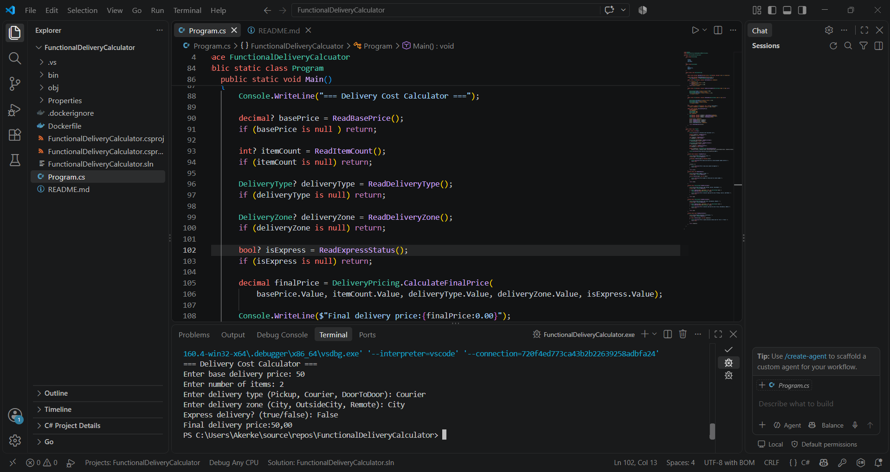
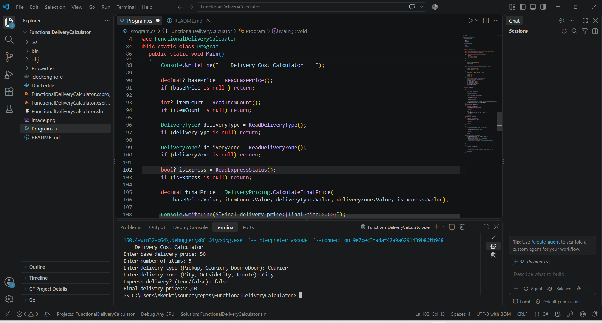
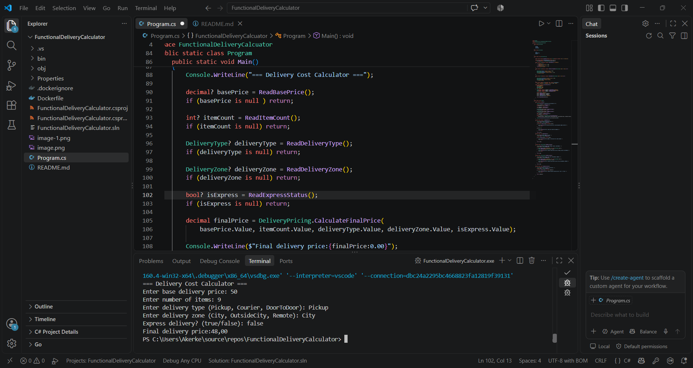
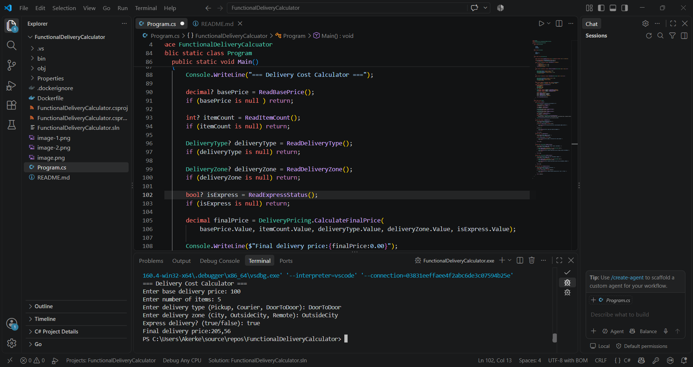
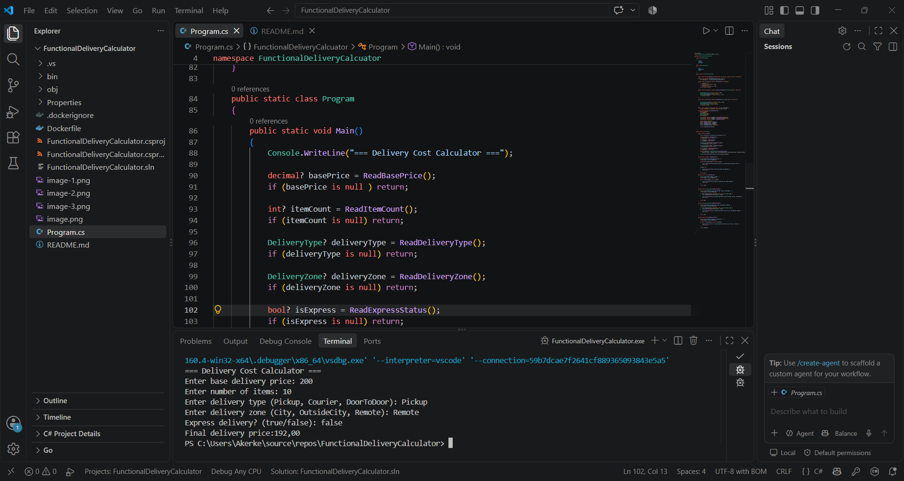
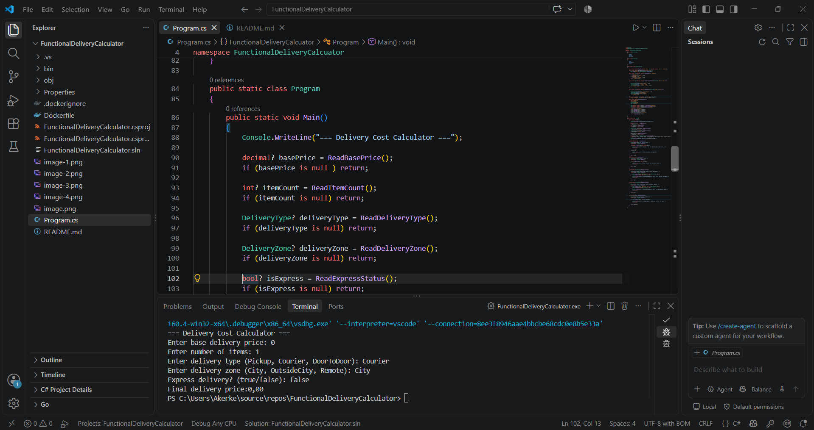
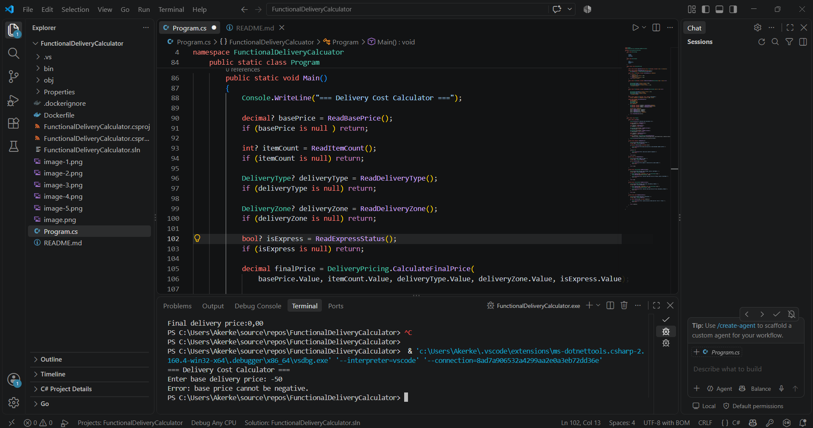
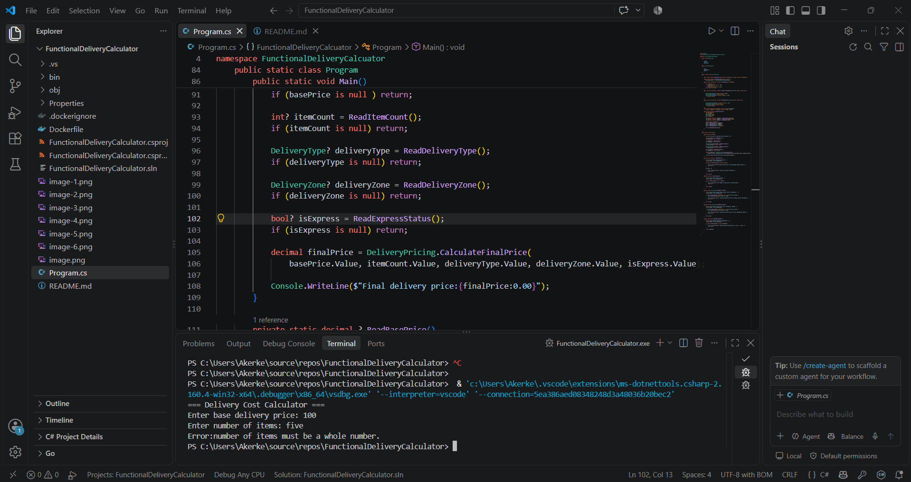
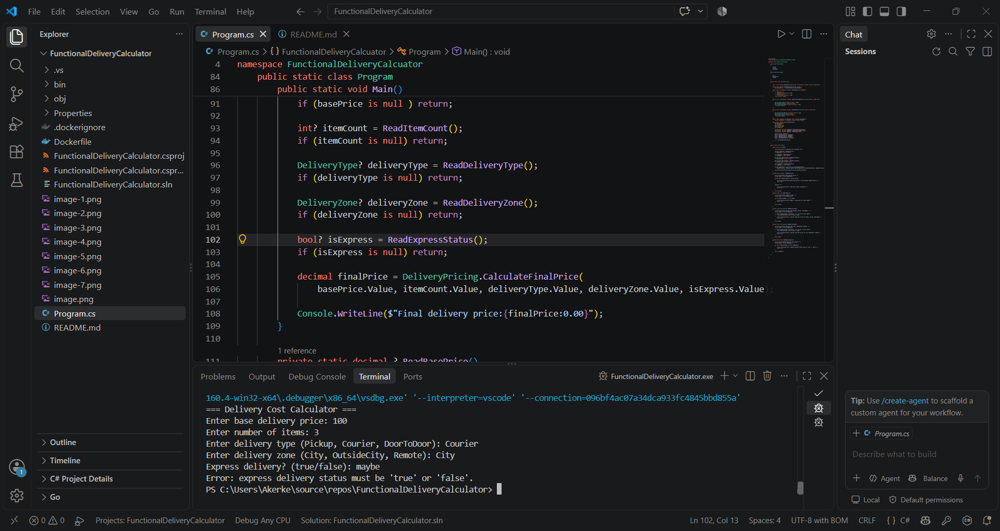
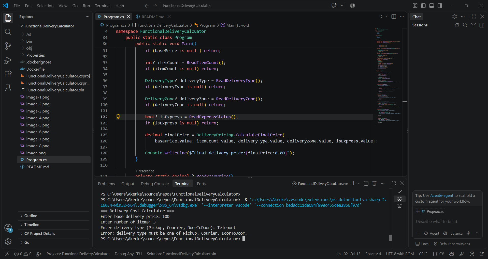
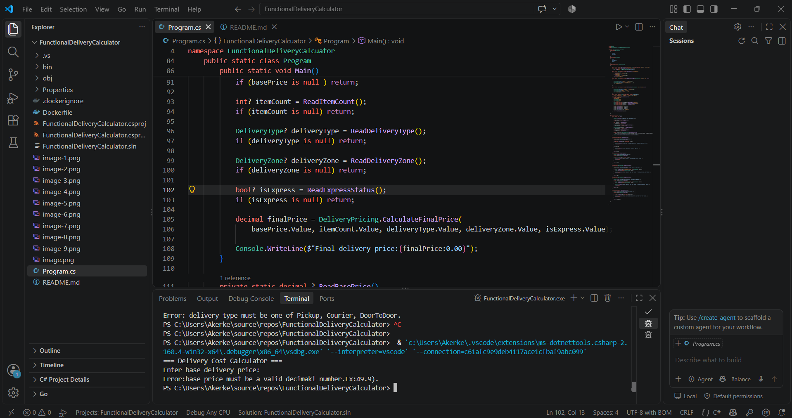

Calculation for test 4, shown step by step:
100 → ×1.10 (5 items) = 110.00 → ×1.15 (DoorToDoor) = 126.50 →
×1.25 (OutsideCity) = 158.125 → ×1.30 (express) = 205.5625 → rounds to
**205.56**.
